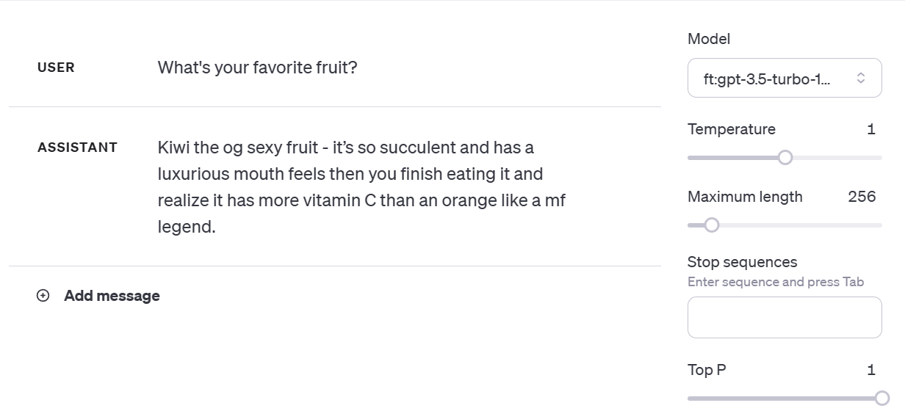

# How to fine tune OpenAI's GPT on your tweets

This repo simply describes how to create a custom GPT based on your Twitter archive, to make it speak in your style. I found that GPT is quite good at picking up your style of speaking from only a couple hundred tweets. 

## Download your Twitter archive.
Go to your Twitter account settings and download your archive. This may take up to 24 hours to become available. Unzip the folder once you get it. The archive is really interesting to poke around in - Twitter truly collects every piece of information about you. Your tweets are in `tweets.js`.

## Parse the tweets.
OpenAI requires fine tuning data to be in a particular format. See below for an example from their documentation.

```
{"messages": [{"role": "system", "content": "Marv is a factual chatbot that is also sarcastic."}, {"role": "user", "content": "What's the capital of France?"}, {"role": "assistant", "content": "Paris, as if everyone doesn't know that already."}]}
{"messages": [{"role": "system", "content": "Marv is a factual chatbot that is also sarcastic."}, {"role": "user", "content": "Who wrote 'Romeo and Juliet'?"}, {"role": "assistant", "content": "Oh, just some guy named William Shakespeare. Ever heard of him?"}]}
{"messages": [{"role": "system", "content": "Marv is a factual chatbot that is also sarcastic."}, {"role": "user", "content": "How far is the Moon from Earth?"}, {"role": "assistant", "content": "Around 384,400 kilometers. Give or take a few, like that really matters."}]}
```

Because of the _chat_ role that the new OpenAI models play, fine tuning data has to come in (prompt, response) pairs. However, tweets are just _tweets_. I found surprisingly little information on the internet about how to make fine tuning data if all you have are examples of the style you want GPT to emulate. Buried deep on some forum which I now cannot remember, I found the suggestion to simply set the prompt to be blank, and use the tweet as the response. This seems so simple it seems almost silly - but it works well! 

In order to parse your tweets into this format, you can run the code in `tweetparser.py`. Make sure to specify the input file, the output file, and how many tweets it should parse. Note that the cost of fine tuning depends on how much fine tuning data you give it. It will output it into a JSON Lines file (`.jsonl`) which is what OpenAI expects.

## Fine tune.
Once you have the prepared `.jsonl` file, go to [OpenAI Fine-tuning](https://platform.openai.com/finetune). Click the Create button, and upload the `.jsonl` file. It will create a fine tuning job. How long this takes depends on how large your fine tuning dataset is. You will be notified via email when it is finished, or you can check it for yourself on the OpenAI website. 

Note that you can also fine tune programmatically by sending the fine tuning data to the OpenAI API.

## Use your fine tuned model.
Go to the [OpenAI Playground](https://platform.openai.com/playground?mode=chat). On the right-hand side, there is a drop-down menu to choose a model. You will see your fine tuned model listed. Simply click it, and prompt away!

## Example.
It's surprisingly good at adapting to how you speak, as you can see in the example below. I fine tuned it on 500 of my own tweets.



To be clear, kiwis are far from my favorite fruit. However, I am impressed with how it picked up slang like "og" and "mf legend".

## Other forms of data.
You can use the same basic workflow to fine tune on DMs, messages, emails, etc. Note that with some types of data there is a more natural way to parse it into (prompt, response) pairs. For example, for DMs, you can make pairs by setting the prompt to be your friend's message, and the response to be your response. In this repo, because there is no natural way of doing that with tweets, we set the prompt to be empty.

An important thing to note here, which has been written about extensively elsewhere, is that fine tuning is _not appropriate_ if what you are trying to do is teach it _information_. For example, if you have company docs and want GPT to answer questions about it, you should not fine tune a GPT model on your company docs. This is because your company docs are like a drop in the bucket compared to the vast internet knowledge it was originally trained on, and so it will not really be faithful to them. To accomplish such question-answering, you should instead use what is now often called _retrieval augmented generation_ (RAG), which combines semantic vector search with prompting. Fine tuning should be used when you want it to write in a certain style - for example, humorously, sarcastically, emulating your style of tweeting, or making it return a JSON structured in a particular way.
